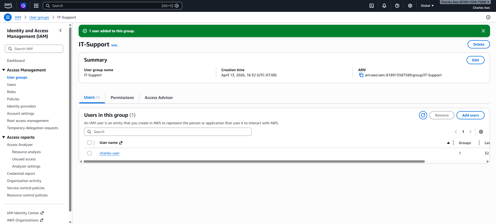
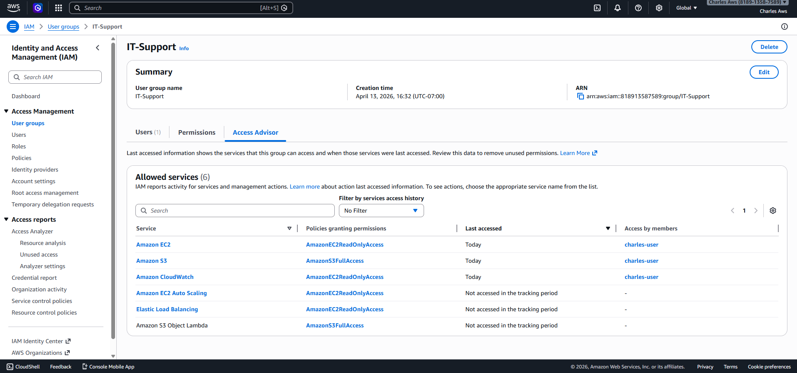
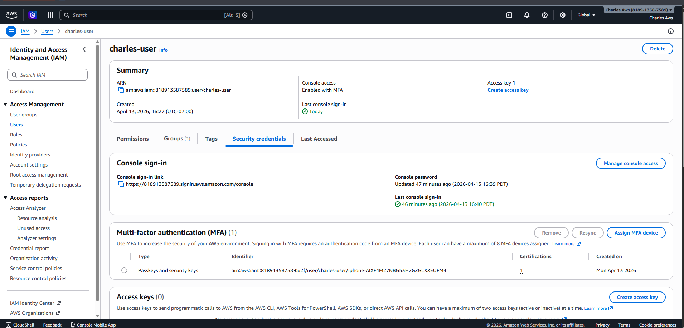

# AWS IAM User & Security Setup

## Overview
I set up IAM users, groups, and permissions in AWS and added MFA for security. This project helped me understand how access control works.

## What I did
- Created an IAM user
- Created a group and assigned permissions
- Added the user to the group
- Tested access to make sure permissions worked
- Enabled MFA for extra security

## Tech Used
- AWS IAM
- Access control
- Security (MFA)

## Screenshots

### User + Group

### Permissions

### MFA Enabled

## What I learned
I learned how to control access in AWS using users and groups, and how to secure accounts with MFA. I also saw how limited permissions work in real scenarios.
